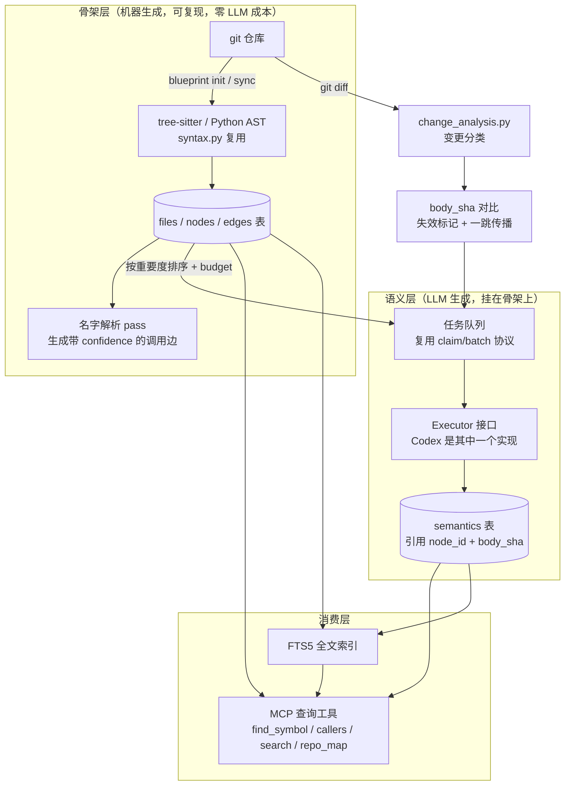
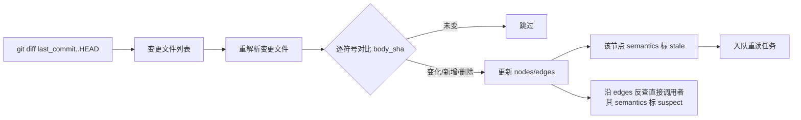

# 骨架层改造方案：从"LLM 全包"到"静态骨架 + LLM 语义层"

> 目标：让 repository-blueprint 兑现"一键生成函数级精细蓝图索引"——骨架零 LLM 成本、立即可用、可复现；语义层按预算渐进补齐；代码变更后增量失效而非整体重建。

## 0. 现状盘点（哪些直接复用）

| 现有模块 | 现状 | 在新方案中的角色 |
|---|---|---|
| `codemap/syntax.py` | 已用 tree-sitter（cpp/csharp/js/ts）+ Python AST 提取 symbols/sites，符号身份 = digest(source, kind, qualified_name, signature)，刻意不含行号 | **直接复用**为骨架提取器，仅需补 `body_sha`（函数体哈希） |
| `codemap/structure.py` | 解析结果按 `cache_key(文件sha256+parser版本)` 存缓存表，`project_structure` 只做展示层投影，不落图 | 缓存升格为**持久骨架层**，投影逻辑退役 |
| `codemap/store.py` | 整图单 JSON 存 SQLite 单行，O(整图) 读写 + 全图 validate | 图 JSON 只保留语义/证据层，骨架改关系表 |
| `codemap/change_analysis.py` | 已有 cosmetic/contract/implementation 变更分类 | **直接复用**为增量失效的分类器 |
| `codemap/agent.py` + `TASK_PROTOCOL.md` | claim/batch 任务租约协议 + Codex 后台执行 | 保留，任务从"读全仓库"降级为"只读失效部分" |
| `codemap/mcp.py` | stdio MCP，工具偏图 CRUD 与任务协议 | 保留框架，**新增 5 个查询工具** |

结论：改造量集中在**存储层**和**查询层**，解析层和任务协议基本不动。

## 1. 总体架构



核心不变式：

1. 骨架层只写机器可验证的事实（签名、位置、边），任何一行都可由重新解析复现。
2. 语义层每条记录必须引用其依据的 `node_id + body_sha`；hash 不匹配即 `stale`，可精确检测，永不静默过期。
3. 边永远带 `confidence`，语法级近似不冒充编译级事实（延续现有 "sites are unresolved" 的诚实原则）。

## 2. 数据模型（SQLite 关系表，替代单 JSON）

```sql
-- 文件层：绑定 commit，增量同步的对账基准
CREATE TABLE files (
    id          TEXT PRIMARY KEY,     -- 现有 source id
    path        TEXT NOT NULL,
    sha256      TEXT NOT NULL,        -- 文件内容哈希（沿用现状）
    language    TEXT,
    parser_id   TEXT,                 -- 沿用 syntax.py 的 backend id，解析器升级可整体重建
    state       TEXT,                 -- parsed / partial / unavailable / unsupported
    commit_id   TEXT,                 -- 生成该行时的 git commit
    updated_at  TEXT
);

-- 符号层：骨架节点
CREATE TABLE nodes (
    id              TEXT PRIMARY KEY, -- 沿用 syntax.py 符号 id（身份不含行号，天然抗行号漂移）
    file_id         TEXT NOT NULL REFERENCES files(id),
    kind            TEXT NOT NULL,    -- function / method / class / struct / namespace / field ...
    name            TEXT NOT NULL,
    qualified_name  TEXT NOT NULL,
    parent_id       TEXT,             -- 文件内嵌套结构
    start_line      INTEGER, end_line INTEGER,
    signature       TEXT,
    body_sha        TEXT,             -- 新增：函数体字节哈希，语义失效的锚点
    updated_at      TEXT
);
CREATE INDEX idx_nodes_qname ON nodes(qualified_name);
CREATE INDEX idx_nodes_file  ON nodes(file_id);

-- 边层：调用 / import / 包含
CREATE TABLE edges (
    src_id     TEXT NOT NULL,         -- 调用方 node id（import 边可为 file id）
    dst_id     TEXT NOT NULL,         -- 被调方 node id 或未解析占位 'name:<text>'
    kind       TEXT NOT NULL,         -- call / import / contains
    confidence TEXT NOT NULL,         -- resolved_local / unique_in_project / ambiguous / unresolved
    site_line  INTEGER,
    PRIMARY KEY (src_id, dst_id, kind, site_line)
);
CREATE INDEX idx_edges_dst ON edges(dst_id, kind);

-- 语义层：LLM 产出，挂在骨架上
CREATE TABLE semantics (
    node_id    TEXT NOT NULL REFERENCES nodes(id),
    body_sha   TEXT NOT NULL,         -- 生成时依据的函数体哈希
    status     TEXT NOT NULL,         -- current / stale / suspect
    summary    TEXT,                  -- 职责摘要
    detail     TEXT,                  -- 设计说明 / 角色 / 注意事项（JSON）
    evidence   TEXT,                  -- 沿用现有 evidence 引用格式（JSON）
    model      TEXT,                  -- 哪个 executor/模型生成的
    created_at TEXT,
    PRIMARY KEY (node_id, created_at)
);

-- 全文检索：符号名 + 签名 + 摘要
CREATE VIRTUAL TABLE search USING fts5(
    node_id UNINDEXED, qualified_name, signature, summary
);
```

迁移策略：现有整图 JSON（entities/evidence/memberships）**暂不动**，作为语义/证据层继续存在；骨架走新表。第二阶段再把 evidence 的 source+line 引用改为引用 `nodes.id + body_sha`，届时 `structure.py::project_structure` 的投影匹配逻辑（`_matches`）整体退役。校验从"全图 validate"改为"写入行级约束 + `blueprint doctor` 定期一致性检查"。

## 3. 骨架构建流水线（`blueprint init`）

```
blueprint init <repo> [--budget N] [--langs cpp,python] [--include/--exclude]
```

1. **扫描**：复用现有 `repository.py` 的文件枚举与语言识别，记录 `commit_id = git rev-parse HEAD`。
2. **解析**：并行调用 `syntax.py::parse`（进程池，现有 `parser_runner.py` 已是独立进程入口），每文件产出 symbols/sites。唯一改动：`Output.symbol` 增补 `body_sha = sha256(raw[start_byte:end_byte])`。
3. **入库**：symbols 写 `nodes`，文件写 `files`，`contains` 边由 parent_id 生成。批量事务，不做全图校验。
4. **名字解析 pass**（新增，纯本地）：把 sites 里的 call 文本解析成边——
   - 同文件内限定名匹配 → `resolved_local`；
   - 全项目 `qualified_name`/`name` 唯一匹配 → `unique_in_project`；
   - 多候选 → 对每个候选建边，标 `ambiguous`；
   - 无候选（外部库等）→ `dst_id='name:<text>'`，标 `unresolved`。
   C++ 后续可选接 clangd index 提升精度，但 v1 不依赖。
5. **建索引**：nodes 批量写入 FTS5。
6. **生成语义任务队列**：按重要度排序（调用入度为主，可选 PageRank），写入现有任务表，等待 executor 认领。`--budget` 限定本轮语义层最多消耗的 token；**骨架本身零 LLM 成本，init 结束即一键可用**。

性能目标：百万行级仓库，骨架构建分钟级（tree-sitter 单文件毫秒级 + 进程池并行），可复现（同 commit 两次构建逐字节一致）。

## 4. 增量更新流水线（`blueprint sync`）



关键设计：

- **对账基准**：`files.commit_id` + `files.sha256`。sync 先 `git diff --name-status`，只重解析变更文件；重命名靠现有 `change_analysis.exact_renames` 识别，符号身份不含行号，纯移动零失效。
- **失效分级**：复用 `change_analysis.classify_change` 的结论——`cosmetic` 只更新行号不失效；`implementation` 只失效该函数的语义；`contract`（签名/导入/默认参数变化）额外把直接调用者标 `suspect`。
- **传播只走一跳**：直接调用者标 `suspect`（低优先级复核），不递归传播，避免改一个底层函数雪崩重建整图。`suspect` 语义仍可被查询返回，但带明确标注。
- **任务复用**：stale/suspect 节点进现有 claim/batch 队列，按入度排序。整套任务协议不改，只是任务来源从"全仓库"变成"失效集合"。

## 5. 语义层与 Executor 抽象

- 语义任务的输入 = 骨架节点（签名、位置、调用者/被调者列表）+ 源码切片，输出 = summary/detail/evidence，写 `semantics` 表并绑定当时的 `body_sha`。
- 现有 Codex 后台执行器降为 `Executor` 接口的一个实现：`claim(n) -> tasks`、`submit(results)`。任何宿主 Agent（Claude、Knot 等）都可以直接通过 MCP 认领任务充当 executor，解除对 Codex CLI 私有 `exec --json` 输出格式的强绑定。
- 预算控制：任务队列带 `estimated_tokens`（按源码切片长度估算），`--budget` 用尽即停，下次 init/sync 继续。大仓库的正确姿势是"骨架全量 + 语义按热点渐进"。

## 6. 查询接口（新增 MCP 工具，索引价值的兑现处）

| 工具 | 参数 | 返回 |
|---|---|---|
| `blueprint_find_symbol` | `name`, `fuzzy?`, `kind?`, `limit?` | 匹配符号：签名 + 位置 + 摘要（含 stale 标注） |
| `blueprint_callers` | `symbol`, `depth<=3`, `limit?` | 反向调用链，每边带 confidence |
| `blueprint_callees` | `symbol`, `depth<=3`, `limit?` | 正向调用链，同上 |
| `blueprint_search` | `query`, `limit?` | FTS5 混合检索符号名/签名/摘要，按 rank 返回 |
| `blueprint_repo_map` | `path?`, `budget_tokens` | 目录级压缩地图（按入度选代表符号），可直接注入下游 Agent prompt |

约定：所有查询只读、毫秒级、无租约；返回中语义字段永远带 `status`（current/stale/suspect），下游 Agent 自行决定信任度。`repo_map` 的输出格式对齐 Aider repo-map 风格（路径 + 关键签名树），便于直接拼 prompt。

## 7. 里程碑

| 阶段 | 内容 | 交付判据 |
|---|---|---|
| **M1 骨架持久化** | `body_sha` 提取；files/nodes/edges/FTS5 建表与入库；`blueprint init` 一键命令 | 对 sample_repo 与一个万行级真实仓库：init 一次成功，同 commit 重跑结果一致 |
| **M2 查询层** | 名字解析 pass 生成带 confidence 的边；5 个 MCP 查询工具 | `find_symbol`/`callers` 对已知调用关系抽查正确率达标；查询 P95 < 100ms |
| **M3 增量** | `blueprint sync`：git diff + body_sha 对比 + stale/suspect 传播 | 改 1 个函数只失效 O(1) 个节点；纯 rename/格式化零失效 |
| **M4 语义调度** | 入度排序 + budget；Executor 接口抽象，Codex 降级为实现之一 | 无 Codex 环境下，宿主 Agent 可通过 MCP 完成语义任务闭环 |

M1+M2 完成后 Skill 即达到"一键可用"；M3 解决腐烂问题；M4 解决成本与宿主绑定问题。

## 8. 风险与对策

- **C++ 调用边精度低**：宏、重载、虚调用无法用名字匹配解决。对策：confidence 分级诚实暴露 + 可选 clangd 后端，不在 v1 阻塞。
- **SQLite 并发**：查询多线程 + 写入单线程即可（骨架写入只发生在 init/sync），开 WAL 模式；比现状的全图乐观锁反而简单。
- **双存储过渡期不一致**：骨架表与旧图 JSON 并存期间，evidence 仍按旧格式校验。对策：过渡期以旧图为语义真源，骨架表只增不改语义；M4 后统一。
- **FTS5 摘要更新**：semantics 变更需同步 FTS 行。对策：写 semantics 的同一事务内 upsert FTS，`blueprint doctor` 兜底比对。
